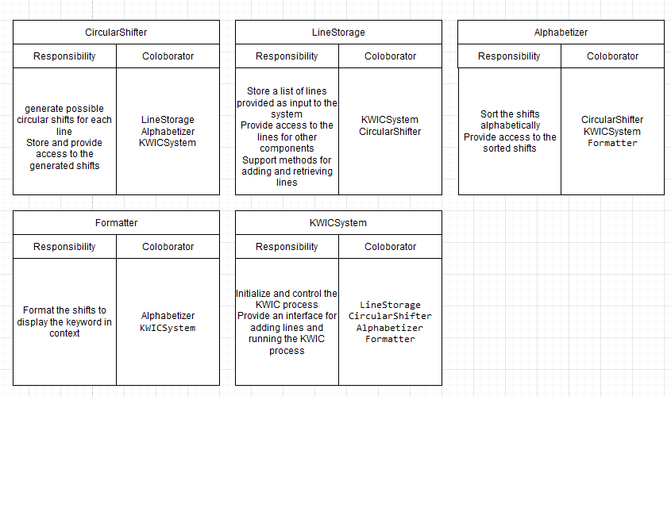

# Project Overview
This solution presented by Roman Kuzmenko.

This project contains two Python programs: `Eight_Queens.py` and `kw.py`.
for Eight Queens (8Q) and Key Word in Context (KWIC) problems accordingly.

## 8 Queens

The `Eight_Queens.py` program solves the classic 8 Queens problem, 
where the goal is to place 8 queens on a chessboard such that no two queens threaten each other.

### How to Run

1. Run the program using the following command:
   python  Eight_Queens.py
   
### Example Output
The program will output the number of solutions found and display each solution in a format where each value of the list reflects the (column number - 1) in which the queen is placed relative to the row index equal to the index of the value. . Here is an example of the output:
```
Total solutions: 92
Solution: (0, 6, 3, 5, 7, 1, 4, 2)
...

```

## KWIC

The `kw.py` program implements a Key Word In Context (KWIC) index. 
It reads lines of text from standard input, generates all circular shifts of each line, 
sorts the shifts alphabetically according a keyword, and prints the sorted shifts.  

### How to Run

1. Run the program using the following command:

```
   python kw.py
```   
### Example Input
The input lines:
```
Some random text
I love Moscow
Hello world
Welcome to notebook
a good place to sleep
just a test and some rest

```
### Example Output
Here is an example of the output:

```
world [Hello] 
Moscow [I] love
love [Moscow] I
text [Some] random
notebook [Welcome] to
to sleep [a] good place
some rest just [a] test and
just a test [and] some rest
sleep a [good] place to
and some rest [just] a test
I [love] Moscow
to [notebook] Welcome
a good [place] to sleep
Some [random] text
test and some [rest] just a
place to [sleep] a good
a test and [some] rest just
rest just a [test] and some
random [text] Some
Welcome [to] notebook
good place [to] sleep a
Hello [world] 
```


LineStorage: This class is responsible for storing the original lines coming into the system. 
It provides an interface for adding and retrieving lines. Separating this class allows us to isolate the data 
from the shifting and sorting processes, making the system more modular and manageable.

CircularShifter: The CircularShifter class creates circular line shifts. This is a key part of the KWIC logic, 
and separating it into a separate class allows this functionality to be independent of other modules such as storage or sorting. 

Alphabetizer: This class sorts circular shifts alphabetically based on a keyword.

Formatter: The formatter is responsible for the final formatting of the results to show the keywords in the center. 
Separating this class provides the flexibility to change the form of the output without restrictions in other modules.

KWICSystem: This class coordinates the interaction of all other classes. 
It implements the main working process system that connects all modules. 
KWICSystem acts as a controller, assembling the system and constantly performing tasks: receiving data, 
generating shifts, sorting and formatting the results.

